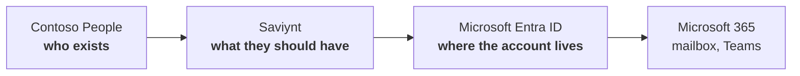

# Demo — What this shows

A hire in **Contoso People** (a hosted HR app) becomes a working Microsoft 365 account because **Saviynt** reads HR over HTTPS and writes **Entra ID** over Microsoft Graph. Two **connected applications**. Nobody opens Active Directory. Nobody waits for Entra Connect.

This series is a **demo**, not a build log. The audience should leave able to explain three arrows. They should not leave able to recite an app-registration wizard.

**⏱ ~15 min talk · ☁ Contoso People + Saviynt + Entra ID**

---

## The three arrows

| System | Allowed to decide | Not allowed to decide |
|---|---|---|
| **Contoso People** | The human: hired, department, manager, Active / Terminated | Passwords, groups, licences |
| **Saviynt** | Birthright, correlation, joiner / mover / leaver | Inventing people who are not in HR |
| **Entra ID** | Holding the account and the mailbox once licensed | Who exists, or what department they are in |

Fix a wrong department in HR. Saviynt reconciles. Entra follows. Never the other way.

---

## What the audience should believe after 15 minutes

1. **HR is the source of truth for people.** Entra is a copy of the access decision, not of the hire.
2. **Saviynt is the brain.** It matches `employeeId` to an Entra account and applies one birthright rule: department → group.
3. **Entra is connected.** Saviynt calls Microsoft Graph. The account appears in the tenant in seconds, `On-premises sync enabled = No`.
4. **Joiner / mover / leaver are the same pipeline.** A click in Contoso People is the business event. Saviynt is the last mile into Entra.

What they do **not** need: VirtualBox, LDAPS, VPNs, OU trees, or how Vercel was wired.

---

## Cast

Same people as the hybrid lab. Three of them are the talk.

| employeeId | Person | Role in the demo |
|---|---|---|
| `10042` | **Priya Sharma**, Finance, Active | **Joiner** — in HR, not in Entra until Saviynt creates her |
| `10001` | **Alice Nguyen**, Sales | **Mover** — department change, groups follow |
| `10012` | **Liam O'Connor**, Sales | **Leaver** — `Terminated`; account disabled, not deleted |

The other nine prove the directory is a workforce, not a single test user.

---

## Talk track

| Min | Scene | What you show | What you say |
|---|---|---|---|
| 0–2 | The arrows | The diagram above | Who exists / what they should have / where the account lives |
| 2–4 | HR | Contoso People UI: Priya `10042` Active, Finance | She is a person. There is still no Microsoft 365 user |
| 4–6 | Both connectors | Saviynt: `ContosoPeople` + `ContosoEntra` **Successful** | HR over HTTPS. Entra over Graph. Nothing on-prem |
| 6–10 | Joiner | Priya appears in Entra, Finance group, sync = No | The hire started in HR. Saviynt created the account |
| 10–12 | Mover | Alice’s department in the HR UI, then groups in Entra | Birthright moved. You did not edit Entra by hand |
| 12–15 | Leaver | Liam **Terminated** in HR, **disabled** in Entra | HR keeps history. The account is not deleted |

Certification (Lab 07) is an encore if the room cares about campaigns.

---

## Scenes in these notes

| # | Scene | What it demonstrates |
|---|---|---|
| 01 | The Entra tenant | The directory on screen is cloud-only Microsoft 365 |
| 02 | Contoso People | People live in a hosted HR app; the joiner is already there |
| 03 | Cloud connectors | Saviynt can **read HR** and **write Entra** |
| 04 | Joiner | Priya is provisioned end to end |
| 05 | Mover | Access follows department |
| 06 | Leaver | Termination disables; it does not erase |
| 07 | Certification | A manager can revoke what birthright granted |

Operator setup (tenant, Vercel/Supabase, Saviynt connections) sits at the **bottom of scenes 01–03**. Do it before the meeting. Do not narrate it.

The HR app lives in [`hr-app/`](hr-app/) — public URL, REST that Saviynt can reach. See [`hr-app/README.md`](hr-app/README.md).

---

## Not this demo

The hybrid sibling (`IDAM-Labs`) shows People → Saviynt → **Active Directory** → Entra Connect. Use that when the story is on-premises accounts and a sync engine. Use **this** demo when the story is “Saviynt governs Microsoft 365 as a connected app.”

Do not mix tenants. A directory Entra Connect already owns will fight Graph writes (`On-premises sync enabled = Yes`).
