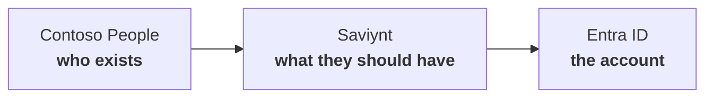

# What this shows

A hire in **Contoso People** becomes a Microsoft 365 account because **Saviynt** reads HR over HTTPS and writes **Entra ID** over Microsoft Graph.

**⏱ ~15 min · ☁ Contoso People → Saviynt → Entra ID**

| System | Decides | Does not decide |
|---|---|---|
| **Contoso People** | Hired, department, Active / Terminated | Passwords, groups, licences |
| **Saviynt** | Birthright, joiner / mover / leaver | Inventing people |
| **Entra ID** | Holds the account | Who exists |

Fix department in HR. Saviynt reconciles. Entra follows.

## Cast

| employeeId | Person | Scene |
|---|---|---|
| `10042` | **Priya Sharma**, Finance | Joiner |
| `10001` | **Alice Nguyen**, Sales | Mover |
| `10012` | **Liam O'Connor**, Sales | Leaver |

## Talk track

| Min | Show | Say |
|---|---|---|
| 0–2 | The arrows | Who exists / what they should have / where the account lives |
| 2–4 | Contoso People: Priya Active, Finance | She is a person. No Microsoft 365 user yet |
| 4–6 | Saviynt: both connections **Successful** | HR over HTTPS. Entra over Graph |
| 6–10 | Priya in Entra, Finance group | The hire started in HR. Saviynt created the account |
| 10–12 | Alice’s department in HR, then groups in Entra | Birthright moved |
| 12–15 | Liam **Terminated** in HR, **disabled** in Entra | HR keeps history. The account is not deleted |

## Scenes

| # | Scene |
|---|---|
| 01 | Entra tenant |
| 02 | Contoso People |
| 03 | Connectors |
| 04 | Joiner |
| 05 | Mover |
| 06 | Leaver |
| 07 | Certification (optional) |

Operator setup is at the bottom of scenes 01–03. HR app: [`hr-app/`](hr-app/).
