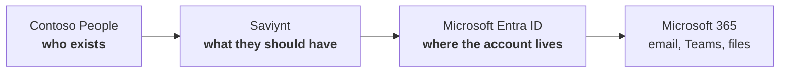
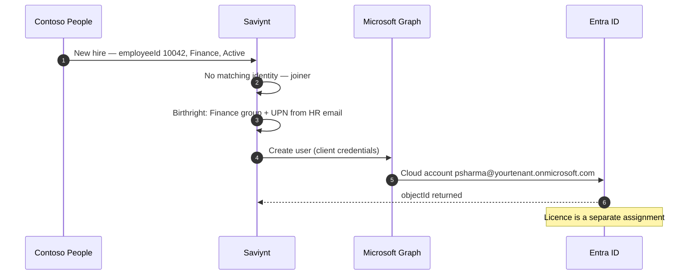

# Plan — Contoso People → Saviynt → Entra ID

This series builds the **cloud-only** identity path: hiring someone in **Contoso People** creates a Microsoft Entra ID account (and a Microsoft 365 mailbox once licensed) because **Saviynt’s Entra connector** writes to Microsoft Graph.

There is no domain controller. There is no Entra Connect. Saviynt is not blocked by a host-only network. The connector is a **connected application**: Saviynt calls Microsoft, Microsoft answers.

The hybrid sibling (`IDAM-Labs`) is People → Saviynt → **Active Directory** → Entra. Same humans. Do not mix the two tenants.

**⏱ ~15 min read · 📶 Beginner · ☁ Microsoft 365 E5 + Saviynt · 🖥 your laptop browser only**

---

## What we are actually building

Three systems, each with one job.

**Contoso People** is the HRIS — a CSV of people (employeeId, department, manager, Active / Terminated). Same roster as the hybrid lab. It does not create Entra users.

**Saviynt** imports those people as identities, evaluates birthright, and **provisions Entra** through the Microsoft Entra ID / Azure AD connector.

**Microsoft Entra ID** is the directory. Accounts here are **cloud-only**. `On-premises sync enabled` stays **No**. A licence turns on the mailbox.

> **Note:** Arrows still only go one way. You do not fix a wrong department in Entra. You change Contoso People, Saviynt reconciles, Entra follows.

---

## Connected vs the hybrid lab

| | Hybrid series (`IDAM-Labs`) | This series |
|---|---|---|
| Account is born in | Active Directory | Entra ID, via Saviynt |
| Saviynt target | LDAPS into a DC (Finish B: tasks in ADUC) | Graph API (connected) |
| Path to the directory | VPN or disconnected | HTTPS to `graph.microsoft.com` |
| Entra Connect | Required | **Do not install** |
| VMs | DC, APP1, Client1 | None |

“Connected application” means Saviynt can **import and write** without a human carrying a task. That works here because Entra is already on the internet, behind OAuth — not because we opened port 636.

HR import is still a **file** in a University L200 tenant (Saviynt cannot GET `http://127.0.0.1:8080`). The **Entra** side is live. That is enough to teach joiner / mover / leaver against a real tenant.

---

## What happens when someone is hired

No 30-minute Connect cycle. Graph create is seconds. Mailbox still waits on **licence** assignment (group-based or by hand).

---

## The labs

Eight labs. No hypervisor.

### Phase 1 — The cloud directory

| # | Lab | Outcome |
|---|---|---|
| 01 | The Microsoft 365 E5 tenant | A **new** tenant you own. Not the hybrid one |

### Phase 2 — Source of truth

| # | Lab | Outcome |
|---|---|---|
| 02 | Contoso People | CSV of thirteen people; emails match the new tenant domain |

### Phase 3 — Connected Entra

| # | Lab | Outcome |
|---|---|---|
| 03 | Saviynt Entra connector | App registration + Graph; **Test Connection** succeeds |
| 04 | Import HR and correlate | Identities from the CSV; Entra accounts linked by UPN / employeeId |
| 05 | Joiner | Priya (`10042`) is created in Entra by the connector |
| 06 | Mover | Department change updates groups in Entra |
| 07 | Leaver | Termination disables (does not delete) the Entra account |
| 08 | Access certification | A campaign against Entra group membership |

> **Tip:** Labs 01–02 need no Saviynt. Do not start the 14-day lab instance until the tenant and CSV are ready.

---

## Tenant rule (read this twice)

> **Warning:** Do **not** point this series at the hybrid lab tenant — the one Entra Connect already syncs (`GpkLabs.onmicrosoft.com` or equivalent). Synced users have `On-premises sync enabled = Yes`. Graph cannot treat them as cloud-born, and Saviynt create/update will collide with Connect. Create a **second** Microsoft 365 trial with a different `onmicrosoft.com` prefix.

Use a tenant you personally own. Never an employer directory.

---

## About the Saviynt trial

Same clock as the hybrid series: **14-day lab instance, renewable**. University L200 comes pre-loaded with IdentCentrix demo people. Leave that demo AD connection alone. This series adds a **new** Entra connection named `ContosoEntra`.

The client secret you put in Saviynt can create and disable users in **your** tenant. Treat it like a Domain Admin password. Do not screenshot it. Do not commit it.

---

## What you need before Lab 01

| Requirement | Detail |
|---|---|
| A laptop | Browser + PowerShell 7 or Windows PowerShell. No extra RAM for VMs |
| A personal email | For the Microsoft 365 trial |
| Payment method | Microsoft may ask for a card; cancel the trial before day 30 |
| Saviynt | University / employer / NFR lab URL — activate at Lab 03 |
| Hybrid series | Optional. Keep it. Separate tenant |

---

## Known risks

> **Warning:** The Entra app registration uses **application** permissions (`User.ReadWrite.All` and similar). Anyone with the client secret can manipulate the tenant. Lab 03 uses a lab-only secret; rotate or delete the app when the series is done.

> **Note:** The E5 trial expires after 30 days. The tenant remains. Graph provisioning still works on the free directory; licensed extras (P2 access reviews, fat mailboxes) may stop.
