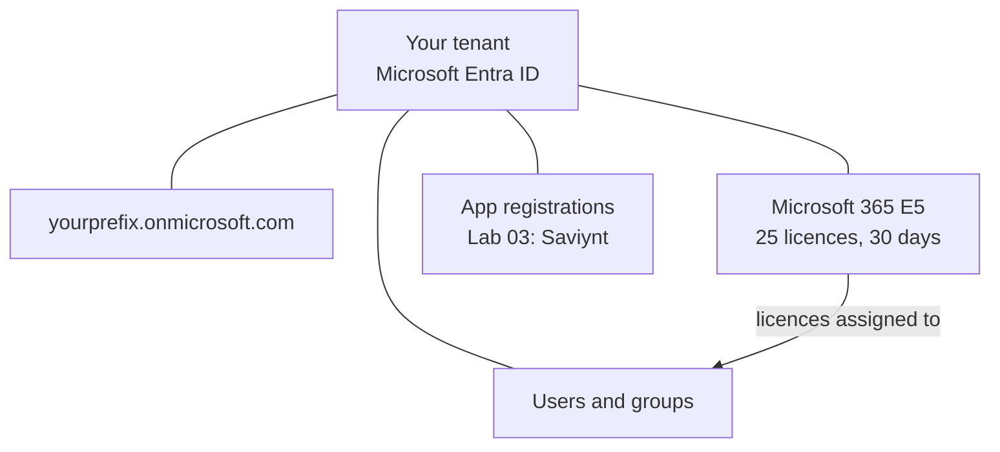

# Lab 01 — The Microsoft 365 E5 Tenant

This series never builds a domain controller. The directory **is** Microsoft Entra ID. This lab creates a tenant of your own, records the values Saviynt will need, and leaves you with one cloud-only test user so you can see what “born in the cloud” looks like before Saviynt starts writing.

**⏱ ~45–60 min · 📶 Beginner · 🖥 host browser · ☁ Creates: a new Entra tenant**

---

## Prerequisites

| | |
|---|---|
| **Where** | Your laptop browser. No VMs |
| **Account** | A personal email that can receive a verification code |
| **Payment method** | Microsoft may ask for a card. It is not charged during the trial if you cancel in time |

> **Warning:** Use a tenant you personally own. Do **not** use an employer tenant. Do **not** reuse the hybrid-lab tenant that Entra Connect is already syncing.

---

## Understanding what you are about to create

A **tenant** is your isolated Entra ID directory — users, groups, applications.

A **subscription** inside it holds licences (Microsoft 365 E5). The tenant survives when the trial ends.

A **domain** is the name. Every tenant gets `<prefix>.onmicrosoft.com`. That prefix **cannot be changed**. Pick a lab name that is not the hybrid one: `contosoiga2026` rather than `GpkLabs`.



Creating a user does not give them a mailbox. Assigning a licence does.

---

## Steps

### 1. Start the Microsoft 365 E5 trial
Open the [Microsoft 365 E5 trial page](https://www.microsoft.com/en-us/microsoft-365/enterprise/e5) and start the free trial.

**Organisation / domain prefix.** This becomes `<yourprefix>.onmicrosoft.com` forever. Do not recycle the hybrid prefix.

**First account.** That user is Global Administrator. Record the UPN and password. There is no DC to reset it from.

> **Tip:** Calendar reminder at day 25. Cancel the paid conversion if you used a card. The directory stays.

### 2. Sign in to the Entra admin center
[entra.microsoft.com](https://entra.microsoft.com) with the Global Administrator. Complete MFA. Security defaults on a new tenant expect it. Keep it.

If that URL shows **Unsupported browser**, use [admin.microsoft.com](https://admin.microsoft.com) or [portal.azure.com](https://portal.azure.com) in current **Microsoft Edge**.

### 3. Record the values later labs need

| Value | Where | Used in |
|---|---|---|
| **Tenant domain** | Entra **Overview** — primary `onmicrosoft.com` | Lab 02 (HR emails), Lab 05 (UPN) |
| **Tenant ID** | Same Overview — GUID | Lab 03 app registration / Saviynt |
| **Global Administrator** | The account you signed in with | Admin consent in Lab 03 |

### 4. Tour the four blades that matter here

This directory is **flat**. There are no OUs. Birthright later is **groups**, not folders.

- **Users** — only the admin so far
- **Groups** — empty; Finance / Sales / … land here in Labs 04–05
- **Roles and administrators** — privileged roles
- **Enterprise applications** / **App registrations** — Lab 03 registers Saviynt here

### 5. Create a cloud-only test user
**Users → New user → Create new user**. Example: `cloudonly@<yourprefix>.onmicrosoft.com`, display name `Cloud Only Test`.

Open the user. Every field is editable. **On-premises sync enabled** is **No**. Every account Saviynt creates should look like this, not like a Connect-synced object.

Keep this user. After Lab 05, open it next to Priya.

### 6. Check licences
**Billing → Licenses** (or Microsoft 365 admin center). Microsoft 365 E5, 25 seats, one on the admin.

| Feature | Requires | This series |
|---|---|---|
| Graph create / disable users | Directory (free) | Labs 03–07 |
| Group-based licensing | Entra ID P1 | Optional in Lab 05 |
| Access reviews | Entra ID P2 | Lab 08 comparison |

E5 includes P2 while the trial lasts.

### 7. Verify
You can sign in to Entra Overview and see the new `onmicrosoft.com` domain and at least two users.

From the **host** (optional):

```powershell
Install-Module Microsoft.Graph -Scope CurrentUser
Connect-MgGraph -Scopes "User.Read.All", "Domain.Read.All"
Get-MgDomain | Select-Object Id, IsVerified, IsDefault
Get-MgUser | Select-Object DisplayName, UserPrincipalName
```

`IsVerified: True` on your `onmicrosoft.com` domain is the result that matters. Lab 02 stamps that domain onto every Contoso People email.

---

## What you have now

A tenant that is not attached to Active Directory, a Global Administrator with MFA, one cloud-only user, and E5 seats. Lab 02 makes the HR file use this domain.
