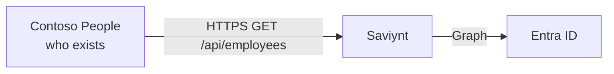

# Lab 02 — HR is the source of truth

Entra can store an account. It is not allowed to know that Priya was hired. That fact lives in **Contoso People** — the hosted HR web app.

This scene is the UI. The demo’s plot is “we clicked in HR, Saviynt did the rest.”

**⏱ ~3 min on stage · ☁ [contoso-people.vercel.app](https://contoso-people.vercel.app)**

---

## What this demonstrates



HR knows **people**: employeeId, department, manager, Active / Terminated. No passwords, no licences.

| Field | What it means in the demo |
|---|---|
| `employeeId` | Durable key. Correlation uses this, not display name |
| `email` | Becomes the Entra sign-in name |
| `department` | Birthright |
| `status` | `Active` = stay/join; `Terminated` = leaver |

Two people can share a name. Two rows cannot share `10042`.

## What the audience should see

Open [https://contoso-people.vercel.app](https://contoso-people.vercel.app) (not localhost). Sign in. People list:

| employeeId | Name | Department | Status | Demo |
|---|---|---|---|---|
| `10042` | Priya Sharma | Finance | Active | **Joiner** — not in Entra yet |
| `10001` | Alice Nguyen | Sales | Active | **Mover** next |
| `10012` | Liam O'Connor | Sales | Active | **Leaver** next |

Line: “Thirteen people. Microsoft 365 has not heard of Priya. HR already has.”

Click Priya. Read the hint on her page. Do not hire, move, or terminate yet.

Do not open Supabase, Vercel, or `/api/employees` in the browser on stage (the API key belongs in Saviynt).

---

## Operator: once, off stage

The app is [`hr-app/`](hr-app/), live at [https://contoso-people.vercel.app](https://contoso-people.vercel.app). Sign-in password is `HR_DEMO_PASSWORD` in local env (not in git).

Before the talk: **Email domain → Apply** so addresses match the Lab 01 `onmicrosoft.com` suffix. Leave Priya Active, Alice in Sales, Liam Active.

Saviynt calls:

```
GET https://contoso-people.vercel.app/api/employees
```

with `x-api-key` (or Basic, password = `HR_API_KEY`). `GET /api/health` (no key) should return `"count": 13`.
