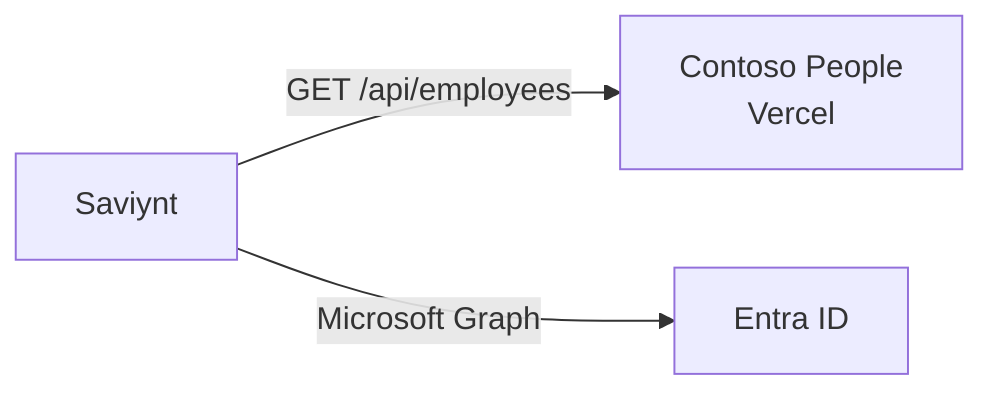
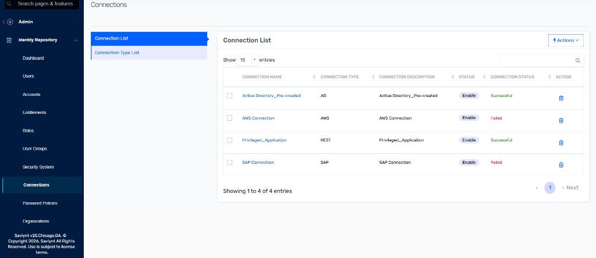

# Lab 03 — Cloud connectors

This scene is the architecture on two connection rows: Saviynt **reads** Contoso People over HTTPS and **writes** Entra over Graph. Both targets are internet services. There is no VPN and no domain controller.

**⏱ ~4 min on stage · ☁ Saviynt Connections**

---

## What this demonstrates

**Connected** means the product imports and provisions. The hybrid series’ AD connector dials into a private network and often cannot. These two connectors can.

IdentCentrix and **Active Directory_Pre-created** are course furniture. Leave them. Demo rows:

| Name | Type | Direction |
|---|---|---|
| `ContosoPeople` | REST | Saviynt ← HR |
| `ContosoEntra` | Azure AD / Entra ID | Saviynt → Entra |

## What the audience should see

| Open | Point at | Line |
|---|---|---|
| **Connections** | `ContosoPeople` **Successful** | “That is the Contoso People web app. Saviynt reads it live.” |
| **Connections** | `ContosoEntra` **Successful** | “That is Microsoft 365, over Graph. Not LDAP.” |
| Either form | No `LDAPS://192.168.56.10` | “If you see a host-only IP, that is the other demo.” |

*L200 already has IdentCentrix AD. Yours are **additional** rows. Do not edit the pre-created AD object.*

Do not paste API keys, client secrets, or Graph permission names unless asked. Then one sentence: “HR is a URL plus a key. Entra is an app registration the tenant consented to.”

---

## Operator: once, off stage

### `ContosoPeople` (REST)

Saviynt REST / WebServices connection:

| Field | Value |
|---|---|
| URL | `https://contoso-people.vercel.app/api/employees` |
| Auth | `x-api-key: <HR_API_KEY>` or Basic with that key as the password |
| Import | JSON array; map `employeeId`, `email`, `department`, `status`, `firstName`, `lastName` |

`GET /api/health` (no key) proves the deploy. Do not put the key in a screenshot.

### `ContosoEntra` (Graph)

In the **demo** tenant from Lab 01 — not the hybrid tenant:

1. **App registrations → New registration** → `Saviynt Contoso Entra`, single tenant, no redirect.
2. Copy client ID and tenant ID. **Certificates & secrets** → new secret; copy **Value** once.
3. **Microsoft Graph → Application permissions**: at least `User.ReadWrite.All`, `Group.ReadWrite.All`, `Directory.Read.All`, `Organization.Read.All`, plus whatever **your** Entra connector guide lists. **Grant admin consent**.
4. Saviynt connection type **Azure AD / Entra ID**, name `ContosoEntra`. Not the AD connector.
5. **Save & Test Connection** succeeds.

| If it fails | Usually |
|---|---|
| HR 401 | Key mismatch |
| HR timeout / DNS | Wrong Vercel URL |
| Entra invalid client | Secret **Value** vs Id |
| `Authorization_RequestDenied` | Consent not granted |
| LDAP timeout | Wrong connector |

Leave provisioning jobs for the joiner scene.
