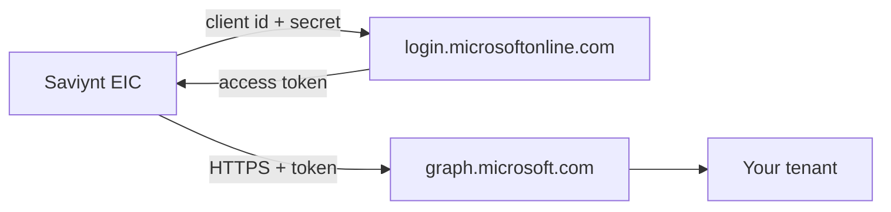
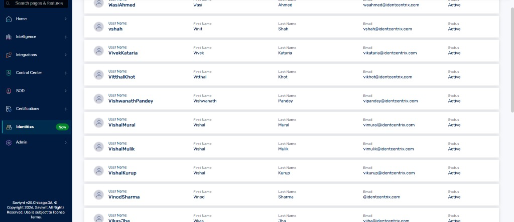
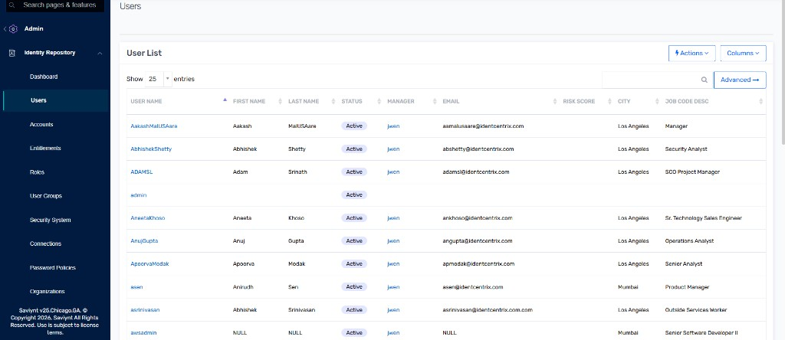
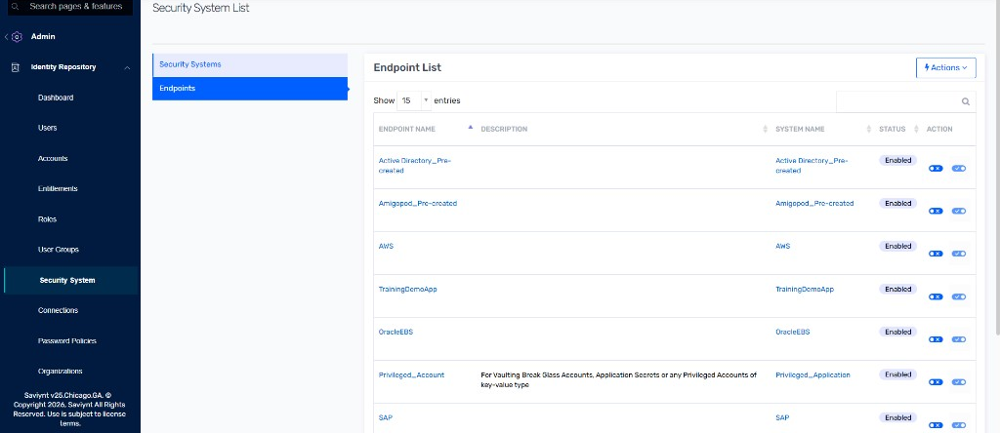

# Lab 03 — Saviynt Entra Connector

Lab 01 gave you a tenant. Lab 02 gave you people. This lab is the wire: an **Entra app registration** that Saviynt uses to call Microsoft Graph with **client credentials**. When **Test Connection** succeeds, Entra is a **connected application** — the opposite of the hybrid lab’s LDAPS timeout.

The 14-day clock starts when the lab instance is issued. Do not idle.

**⏱ ~45–75 min · 📶 Intermediate · ☁ Entra app registration + Saviynt EIC**

---

## Prerequisites

| | |
|---|---|
| **Prior labs** | Lab 01 (tenant ID + domain) and Lab 02 (CSV stamped) |
| **Access** | Global Administrator on the **new** tenant |
| **Saviynt** | University / employer / NFR EIC URL |

> **Warning:** Do not register this app in the hybrid-lab tenant. Do not paste the client secret into a screenshot, chat, or git commit.

---

## Why this works without a VPN

Saviynt’s AD connector **dials into your network**. Graph does not. Saviynt (in AWS) presents the app’s client ID and secret to `login.microsoftonline.com`, receives a token, and calls `graph.microsoft.com`. Both names are on the public internet. Your laptop does not need to accept inbound connections.

That is the definition of **connected** here: Saviynt can import accounts and create Priya without you opening ADUC.

University L200 still cannot GET your CSV over REST. Leave HR as a file import (Lab 04). Do not merge Contoso people into IdentCentrix demo users.

---

## Steps

### 1. Register the application in Entra
[entra.microsoft.com](https://entra.microsoft.com) → **Applications → App registrations → New registration**.

| Field | Value |
|---|---|
| Name | `Saviynt Contoso Entra` |
| Supported account types | **Accounts in this organizational directory only** (single tenant) |
| Redirect URI | leave empty |

**Register**. On **Overview**, copy:

- **Application (client) ID**
- **Directory (tenant) ID** — must match Lab 01

### 2. Create a client secret
**Certificates & secrets → New client secret**. Description `lab-03`. Expiry: the shortest that covers the 14-day Saviynt window (or 90 days if that is the minimum).

Copy **Value** now. It is shown once. That string is the password for directory writes.

### 3. Graph application permissions
**API permissions → Add a permission → Microsoft Graph → Application permissions** (not Delegated). Add at least:

| Permission | Why |
|---|---|
| `User.ReadWrite.All` | Create, update, disable users |
| `Group.ReadWrite.All` | Birthright groups |
| `Directory.Read.All` | Import / correlate |
| `Organization.Read.All` | Tenant lookup on test |

Saviynt’s Entra / Azure AD connector docs for **your** EIC version may also list `Directory.ReadWrite.All` or role-management scopes. Add what the connection form or the connector guide asks for. Do not add everything in the catalogue.

**Grant admin consent for [your tenant]**. Status must show **Granted**. Without consent, Test Connection fails with `Authorization_RequestDenied` even if the secret is right.

### 4. Open Saviynt
Sign in to **your** EIC URL. IdentCentrix demo people (`@identcentrix.com`) are course data.

***Identities** on a University L200 tenant. Not Contoso. Leave them.*

***Admin → Identity Repository → Users**. Click **Connections** in the left menu.*

***Endpoints**. **Active Directory_Pre-created** is IdentCentrix. Do not repoint it at Entra.*

***Connections**. Create a **new** connection. Do not edit **Active Directory_Pre-created**.*

### 5. Create connection `ContosoEntra`
**Actions** (or **Add**) → connection type **Azure AD** / **Entra ID** / **Microsoft Entra ID** — whatever your version labels the Graph connector. Name it `ContosoEntra`.

Typical fields (labels vary by release):

| Field | Value |
|---|---|
| Tenant ID / Azure Tenant | Lab 01 GUID |
| Client ID / Application ID | Lab 03 app |
| Client secret | the Value from Step 2 |
| Authentication | Client credentials / OAuth 2.0 |

There is no LDAP URL. If the form asks for `LDAPS://…`, you picked the **AD** connector — cancel and choose Entra / Azure AD.

**Save & Test Connection**. This should **succeed**. If it fails:

| Symptom | Likely cause |
|---|---|
| Invalid client / secret | Secret Value not Id; expired; extra space |
| `Authorization_RequestDenied` | Admin consent not granted, or missing application permission |
| Wrong tenant | App lives in the hybrid tenant |
| Timeout to `192.168.56.10` | Wrong connector (AD) |

### 6. Leave HR and provisioning jobs for Lab 04
Do not import the CSV yet. Do not create Priya by hand in Entra. Test Connection succeeding is the whole lab.

Store the client ID and tenant ID in your own notes. The secret stays in Saviynt and in a password manager, not in this repo.

---

## What you have now

Saviynt can authenticate to your tenant as an application. Entra is connected. IdentCentrix is untouched. Lab 04 imports Contoso People and correlates them to Entra accounts (empty directory except admin + `cloudonly` — the twelve and Priya are still joiners until provisioning runs).
