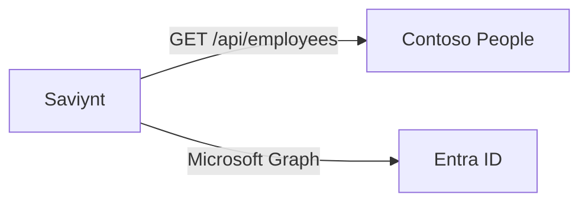

# Lab 03 — Connectors

Saviynt **reads** Contoso People over HTTPS and **writes** Entra over Graph.

**⏱ ~4 min · ☁ Saviynt Connections**

| Name | Type | Direction |
|---|---|---|
| `ContosoPeople` | REST | Saviynt ← HR |
| `ContosoEntra` | Azure AD / Entra ID | Saviynt → Entra |

Leave any pre-created connections in the tenant. Add these two.

## What the audience should see

| Open | Point at | Line |
|---|---|---|
| **Connections** | `ContosoPeople` **Successful** | Contoso People. Saviynt reads it live |
| **Connections** | `ContosoEntra` **Successful** | Microsoft 365, over Graph |

Do not paste keys or Graph permission names on stage.

## Operator

### `ContosoPeople`

| Field | Value |
|---|---|
| URL | `https://contoso-people.vercel.app/api/employees` |
| Auth | `x-api-key: <HR_API_KEY>` (or Basic, password = that key) |
| Import | JSON array; map `employeeId`, `email`, `department`, `status`, `firstName`, `lastName` |

### `ContosoEntra`

In the Lab 01 tenant:

1. **App registrations → New registration** → `Saviynt Contoso Entra`, single tenant, no redirect.
2. Copy client ID and tenant ID. New client secret — copy **Value** once.
3. Graph **application** permissions: `User.ReadWrite.All`, `Group.ReadWrite.All`, `Directory.Read.All`, `Organization.Read.All`, plus whatever the Entra connector guide lists. **Grant admin consent**.
4. Saviynt connection type **Azure AD / Entra ID**, name `ContosoEntra`. Test succeeds.

| Fail | Usually |
|---|---|
| HR 401 | Key mismatch |
| HR timeout | Wrong URL |
| Invalid client | Secret **Value** vs Id |
| `Authorization_RequestDenied` | Consent not granted |
