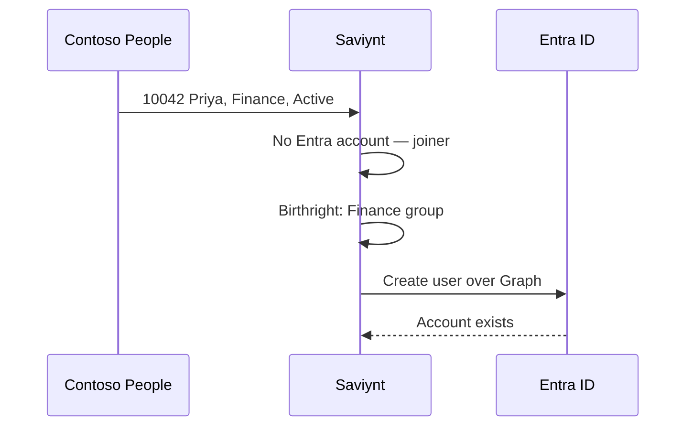

# Lab 04 — Joiner

A joiner is a **gap**: HR says Priya exists and is Active; Entra does not have her. Saviynt closes the gap by creating the cloud account.

**⏱ ~5 min on stage · 👤 Priya Sharma `10042`**

---

## What this demonstrates

| Before | After |
|---|---|
| Priya `10042` Active in Contoso People | Still there — HR does not delete on hire |
| No `psharma@…` in Entra | Cloud user, **On-premises sync = No** |
| No Finance membership | Member of the Finance birthright group |

The hire did not start in the Microsoft 365 admin center.

## What the audience should see

1. **HR** — Priya, Finance, Active in Contoso People (not Entra).
2. **Entra Users** — search `psharma` **before** provisioning: nothing. Search **after**: Priya, UPN = her HR email, sync = **No**.
3. **Entra Groups** — Finance (or `G-Finance`) includes Priya.
4. Optional: **Licenses** — E5 on Priya, then [office.com](https://www.office.com) in InPrivate. Licence is a separate beat: “Sync copies the person; a licence turns on Outlook.” If seats are tight, skip the mailbox. The account existing is the joiner.

Line: “HR hired her. Saviynt decided Finance. Entra only stored it.”

## Operator: before and during

Off stage, once: REST import from `GET /api/employees` into Saviynt (`ContosoPeople`), map `employeeId` / email / department / status, correlate on email = UPN then stamp `employeeId`. Birthright: `department = Finance` → Finance group. Security system = `ContosoEntra`.

On stage: leave Priya **Active** in the HR app. Run the provisioning job (or refresh Entra if it already ran). Do not create Priya by hand in Entra — that kills the demo.
